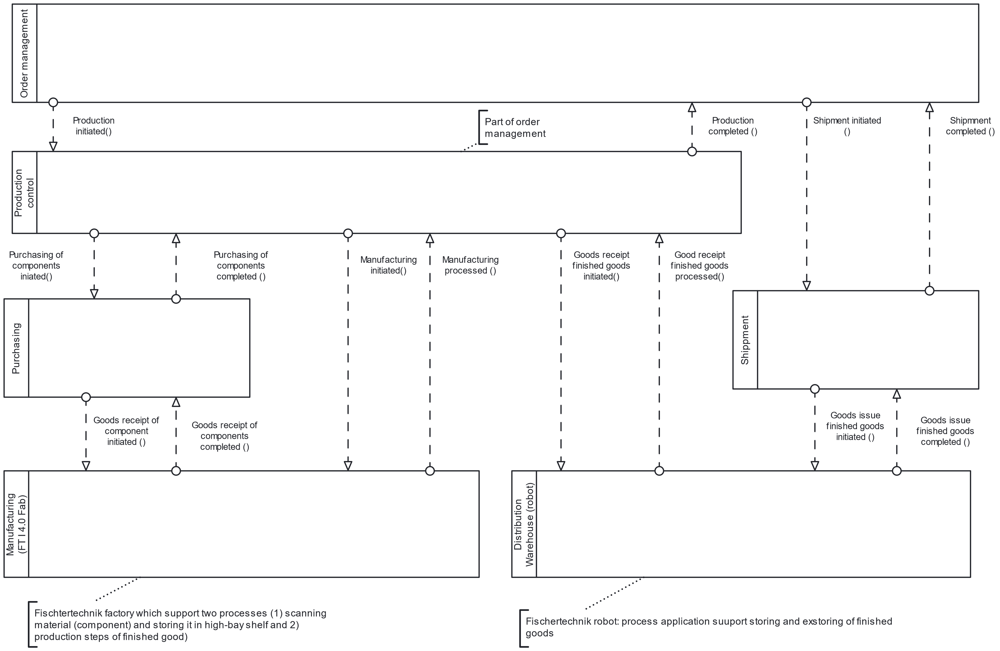

## The implemented scenario

**A bicycle manufacturer offers highly customisable bicycles to consumers.**

The entire end-to-end process is orchestrated by the **order management process**, which in turn initiates purchasing, manufacturing, and shipping processes as needed.

{#fig-landscape fig-align="center"}

The manufacturing processes use the **Fischertechnik Industry 4.0 factory** to post goods receipts of components and to perform the actual manufacturing steps. Order management and shipping additionally use the **distribution warehouse** (a separate Fischertechnik robot) to post goods receipts and goods issues for finished products.

The following sections describe each sub-process in turn. The process models do **not** include technical aspects and show only the **happy path** of execution.

## Order management

{#fig-ordermgmt fig-align="center"}

The order management process governs the fulfilment of customer orders.

It starts when a customer order is entered into a web form, which is pre-filled with product data (bicycle models) from the database. During execution, the **availability of the ordered products** is checked.

Two main scenarios apply:

- **All products in stock:** the shipping process is triggered directly. Once shipping completes successfully, the process is finished.
- **One or more products out of stock:** for each unavailable product, the production control process is triggered, which creates a **production order**. The production order specifies the required components.
  - If the components are also unavailable, a **purchasing process** is started first.
  - Otherwise, the **manufacturing process** is triggered immediately.

Once the missing products are manufactured, shipping is initiated.

## Production control

{#fig-prodcontrol fig-align="center"}

The production control process manages the creation and execution of **one production order for one product**. It determines the component demand and — if needed — triggers a purchasing process to procure the missing components. Once components are available, it triggers the actual manufacturing process.

## Purchasing

{#fig-purchasing fig-align="center"}

The purchasing process manages the procurement of required components. It starts whenever a component is needed and creates a **purchase order**.

The purchase order can be adjusted by the user — for example by selecting a specific vendor. Materials are then stored and stock levels are updated. Upon user confirmation (or after a configurable timeout), the stock level is increased in the inventory database.

## Manufacturing

{#fig-manufacturing fig-align="center"}

The manufacturing process governs the **physical manufacturing simulation** on the Fischertechnik factory for **one item of one product type**.

It starts after a production order has been created by the production control process and sufficient components are available.

The process must place a manufacturing order that produces a new bicycle from the specified material. Before that, however, it must check whether a **physical workpiece** is already available in the warehouse of the Fischertechnik factory. If not, a physical workpiece must first be transferred to the factory so that the control program can store and recognise it. Once the bicycle has been produced from the material (workpiece), the process is complete.

## Shipment

{#fig-shipment fig-align="center"}

The shipment process manages the dispatch of finished goods to the customer. It is **only** triggered if a product is in stock and ready to be shipped.

The flow is:

1. Shipping data is checked.
2. The distance and duration from the warehouse to the delivery address are computed — the **Openrouteservice API** is used for this.
3. The logistics sub-process retrieves the customer order from the warehouse.
4. A message is sent to the customer to inform them about the dispatch.
5. Upon handover of the order to the customer, both the shipping process and the surrounding end-to-end process instance are completed.

## Warehouse operations

The warehouse operations process governs the flow of finished goods in a distribution warehouse — represented physically by the Fischertechnik warehouse robot.

It starts when a **transfer order** for the warehouse is received from another business process. A transfer order can be either an instruction to **store products** in the warehouse or to **retrieve products** from it.

## Teaching note

::: {.callout-tip}
## Process landscape as a teaching tool
This process landscape works well to introduce key BPMN concepts in context:

- **message-based communication** between long-running processes,
- **boundary events** to handle exceptions raised by job workers,
- **multi-instance activities** for handling several products in a single order.

:::
