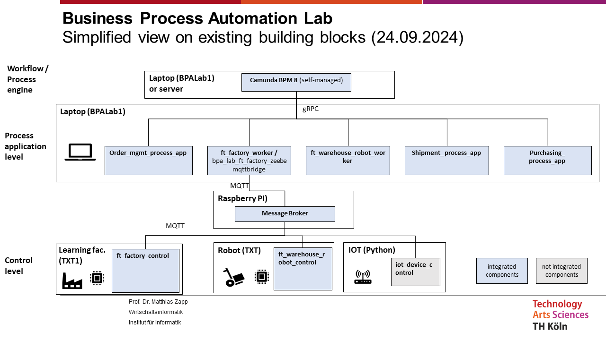

## A modular, domain-driven design

A key design principle in the BPA Lab is **modularity**. The system aims for aspects of a  **Domain-Driven Design (DDD)** approach so that:

- **multiple students and developers can work in parallel** on different parts of the system without stepping on each other's toes,
- **components can be reused** in student projects to build new process applications,
- **components can be replaced or upgraded** independently.

The primary criterion for splitting job workers and process models is the **business domain**:

- Order management
- Manufacturing
- Shipping
- Purchasing
- Logistics / warehouse operations

This separation aligns with the bounded contexts familiar from DDD and makes the system easier to reason about, both for teachers explaining it and for students extending it.

## A simplified bird's-eye view

The architecture and implementation of the BPA Lab are under continuous development. The following diagram shows the main components of the solution .

{#fig-simplified fig-align="center"}

The customer-facing entry point is a **user form** (or **web application**= for order capture. From there, work flows downwards through Camunda 8 and the job workers and eventually reaches the physical Fischertechnik components. Events generated along the way flow back upwards and are persisted in databases for later analysis.

## Three architectural layers

The solution is structured into three clearly separated layers.

### Layer 1 — Controllers

**Controllers** are responsible for the direct control of hardware components: the Fischertechnik Industry 4.0 factory, the Fischertechnik warehouse robots, and IoT devices. They are predominantly implemented in **Python** and translate high-level commands (for example *"transport workpiece from slot A to slot B"*) into the low-level signals that move motors and read sensors.

### Layer 2 — Process applications (job workers)

**Process applications** are middleware components that implement the actual business logic of individual work steps. In Camunda 8 terms, they are **job workers**: they subscribe to specific service tasks and execute them when activated by the workflow engine.

Job workers communicate:

- with the **workflow engine** via **gRPC** (the standard Camunda 8 / Zeebe protocol),
- with the **controllers** via **MQTT** (a lightweight publish-subscribe protocol that is well established in the IoT space).

Process applications are predominantly implemented in **Java**.

### Layer 3 — BPMS workflow engine

The central workflow engine is **Camunda 8 (self-managed)**. It executes:

- **BPMN** process models — describing how work flows through the system,
- **DMN** decision models — encoding business rules.

Camunda 8 maintains the state of each running process instance, handles incidents, and provides the data foundation for process mining and analytics.

## The demonstration factory implementation

The latest version of the BPA Lab as a runnable **demonstration factory** is available in a separate repository:

➡️ [github.com/BpaLabTHCologne/bpa_lab_demonstration_factory](https://github.com/BpaLabTHCologne/bpa_lab_demonstration_factory)

The implementation is fully containerised with **Docker**. This makes local setup straightforward and ensures that the environment is reproducible across different machines — a key requirement when students set up the system on their own laptops.

::: {.callout-tip}
## Getting started in practice
If you are setting up the BPA Lab for the first time, start with the `docker-compose.yml` of the demonstration factory and follow the installation guide there. To develop your own components on top of the lab, the [student-docs wiki](https://github.com/BpaLabTHCologne/bpa_lab_student_docs/wiki) provides component-level guides.
:::
