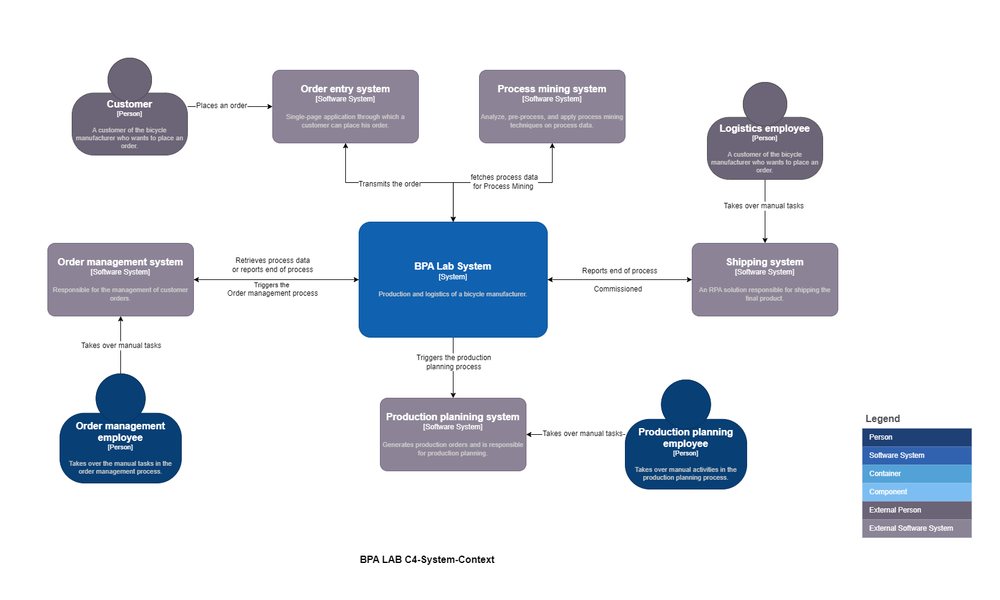
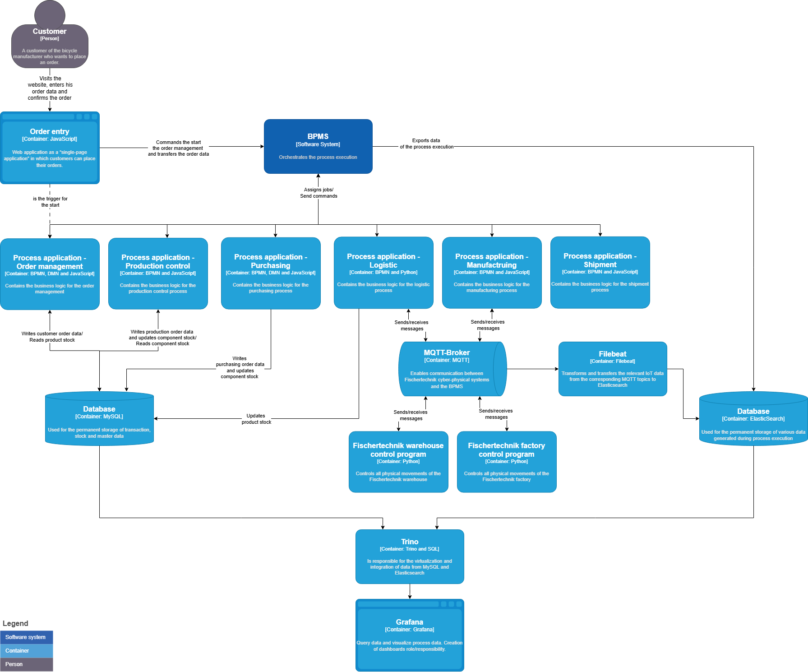

::: {.callout-important}
## Status
The architecture is under continuous development. Several aspects are still being discussed. This chapter captures the current state.
:::

## Requirements

The following high-level requirements were gathered at the very beginning of the BPA Lab project (originally as part of a thesis project). They served as the basis for the first software architecture and remain the reference point against which architectural choices are evaluated.

### R1 — Independent operation of components

The individual components and processes should be able to run independently of each other. Each process must be startable on its own, without depending on a triggering instance from a higher layer.

### R2 — Integration of external IT systems

The system must allow integration with existing IT components — for example with the web application used for order capture, or with tools that flexibly extract data for process mining and analytics.

### R3 — Clear and distinct responsibilities

The responsibilities of individual components must be clearly defined and demarcated from one another, so that the system remains understandable as it grows.

### R4 — Easy extensibility

The system must be easy to extend with additional, self-developed components.

### R5 — Interchangeability and independent evolution

Components must be developable, deployable, and replaceable independently of one another.

### R6 — Comprehensive and flexible process data capture

Process data must be comprehensively capturable. It must be stored and made flexibly available for a range of analytical use cases — in particular process mining.

### R7 — User-friendliness (operator perspective)

The user interface must be intuitive and easy to understand, ensuring a positive user experience for those interacting with the lab during demonstrations and student sessions.

### R8 — Easy installation and low infrastructure requirements (developer perspective)

The system must be easy to install. Students must be able to host their own instances on standard laptops without specialised infrastructure.

### R9 — Robustness

The architecture must be robust. Failures must be minimised and reliable functionality must be ensured under a wide range of operating conditions.

### R10 — Maintainability and operation

The system must be easy to maintain over its lifetime.

## Architecture in the C4 model

The architecture is documented using the **C4 model** [@brown2018c4] — a notation for describing software systems at different levels of abstraction: Context, Container, Component, and Code. Note that *containers* in the C4 sense are **not** the same as Docker containers.

### Context diagram

The context diagram shows the BPA Lab in relation to its users and external systems. It is a conceptual diagram that abstracts away from actual technical implementation of interfaces.

{#fig-c4-context fig-align="center"}

### Container diagram

The container diagram shows the main technical building blocks of the BPA Lab and how they interact.

{#fig-c4-container fig-align="center"}

## Architecture decisions

The remainder of this chapter records selected architecture questions raised during the BPA Lab project, together with the corresponding decisions and justifications. The list is **not exhaustive** and is updated as the lab evolves.

Each decision follows a lightweight **ADR** (Architecture Decision Record) schema: context, decision, and rationale are captured succinctly.

### ADR-001 — MQTT broker for job-worker–controller communication

**Status:** Decided.

**Decision:** A MQTT broker is used for communication between process applications (job workers) and controllers.

**Rationale:**

- decoupling of senders and receivers through the publish-subscribe pattern,
- MQTT is a well-established standard protocol in the IoT space,
- lightweight footprint, well suited to the hardware components in use.

### ADR-002 — Message Send/Receive Tasks instead of Events for inter-process communication

**Status:** Decided.

**Decision:** Inter-process communication is modelled in BPMN using **Message Send Tasks** and **Message Receive Tasks**, not events.

**Rationale:**

- Tasks allow the use of **boundary events** — for example to handle errors raised by job workers,
- complex error paths and timeouts are easier to express.

### ADR-003 — Messaging between processes and process applications

**Status:** Decided.

**Decision:** Communication between processes and process applications is implemented using messages as well.

**Rationale:**

- a simple, uniform solution,
- consistent with the communication pattern between process applications and process control.

### ADR-004 — Camunda 8 self-managed with Docker Compose (Camunda 8 Core)

**Status:** Decided.

**Decision:** The self-managed variant of Camunda 8 is used in combination with Docker Compose and Camunda 8 Core.

**Rationale:**

- avoids interferences between contributors during the development phase,
- development and production-like environments are identical,
- Kubernetes is intentionally not used — the BPA Lab is not a production environment in the classical sense.

**Open question:** Performance with Docker and the resulting number of containers needs to be verified as the system grows.

### ADR-005 — Job worker for sending emails

**Status:** Decided (reversible).

**Decision:** Email sending is implemented through a dedicated job worker rather than via the SendGrid connector.

**Rationale:**

- issues encountered with the SendGrid connector at the time of the decision,
- an existing solution was already in place in the project,
- to be re-evaluated as Camunda 8 connectors continue to evolve.

### ADR-006 — Job worker for database transactions; MySQL in a Docker container

**Status:** Decided.

**Decision:** Database transactions are handled by a dedicated job worker; the MySQL database runs in a Docker container.

**Rationale:**

- existing solution available in the project,
- greater flexibility than the connectors available at the time of the decision.

::: {.callout-tip}
## Further reading
The original sources on the C4 model — including examples, decision records, and tools like [Structurizr](https://structurizr.com/) — are available at <https://c4model.com/>. For a deeper dive into Domain-Driven Design as the principle behind the modular separation, see Evans [@evans2003ddd].
:::
