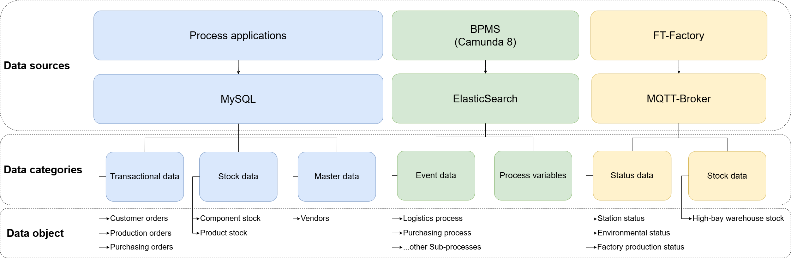
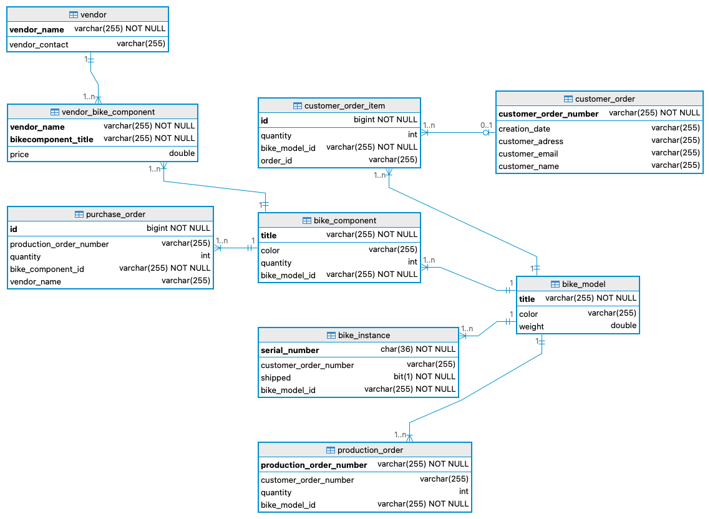

::: {.callout-note}
## Learning objectives
After reading this chapter, you will be able to:

- identify the main data sources in the BPA Lab,
- describe the role of the relational database in the overall architecture,
- explain how process and event data become the foundation for process mining.
:::

## Overview of data sources

The BPA Lab integrates data from several sources — from **master data** in a relational database, via **process state** maintained by the workflow engine, to **sensor and telemetry data** from the Fischertechnik components.

The following figure gives an overview of the main data sources and the kinds of data they hold:

{#fig-data-overview fig-align="center"}

## The MySQL data model

The following diagram shows the concrete data model of the MySQL database, including the entities and attributes of the current implementation:

{#fig-mysql fig-align="center"}

The database serves as the central store for:

- **Product master data** — bicycle models and their components,
- **Customer data** and delivery addresses,
- **Stock levels** for components and finished goods,
- **Orders** — customer orders, production orders, purchase orders — together with their status history,
- **Vendor data**.

## Sample and master data

Documentation and sample data of the Fischertechnik factory are available in the [`Sample_data`](https://github.com/BpaLabTHCologne/bpa_lab_docs/tree/main/Sample_data) folder of the documentation repository. This data serves as:

- **initial master data** when setting up a new instance of the BPA Lab,
- **test data** for developing new components,
- a **demonstration baseline** for teaching sessions and presentations.

## Process data and the foundation for process mining

In addition to persistent master data, the running processes generate substantial amounts of **process data**:

- **Camunda 8** stores process instance data, variables, tokens, and lifecycle events.
- **MQTT messages** record the communication between job workers and controllers.
- **Job worker logs** capture technical operations and exceptions.

This event data is the foundation for **process mining** — a central teaching and demonstration component of the BPA Lab. Process mining allows students to:

- **discover** the actual flow of processes from event logs (and compare them to the modelled flow),
- **check conformance** between modelled and actual behaviour,
- **analyse performance** — durations, bottlenecks, rework loops.

## Data lifecycle and analytics

Looking at the data lifecycle as a whole:

1. **Master data** is loaded once when the lab is set up and updated when new products, customers, or vendors are added.
2. **Operational data** — orders, stock movements, production orders — is created continuously as processes run.
3. **Event data** is emitted by the workflow engine, the job workers, and the MQTT broker as side effects of process execution.
4. **Analytical data** is derived from the above by export and transformation pipelines, then fed into process-mining and BI tools.

This layered view of data is itself a teaching opportunity: it mirrors the classical separation of OLTP and OLAP systems that students will encounter in industry.
