## Purpose of this chapter

This chapter provides selected **operational instructions** for running, configuring, and monitoring the BPA Lab demonstration factory. While the preceding chapters describe *what* the BPA Lab is, this chapter describes *how* to configure anbd use it. The instructions are not complete but rather focus on selected aspects that are particularly relevant for the demonstration factory. 

The instructions are organised into four sections:

1. **Working with the productive environment** — how to prepare and connect the physical model factory before starting the process applications.
2. **Running an end-to-end process instance** — a step-by-step walkthrough of one full order-to-shipment process from the user perspective.
3. **First-time configuration of the data architecture** — one-time setup of Elasticsearch and Grafana that is required after an initial installation or reinstallation of the system to enable the data-driven process analysis.
4. **Using the data architecture for process analysis and monitoring** — overview of the data architecture and how to access the Grafana dashboards for data-driven process analysis.

## Installing and running the solution

The instructions to install and run the BPA Lab solution (software only) are described in the README of the [bpa_lab_demonstration_factory repository](https://github.com/BpaLabTHCologne/bpa_lab_demonstration_factory). 

The following instructions in this chapter are building upon those.

## Working with the productive environment of the model factory

The *productive environment* refers to the setup in which the process applications are connected to the **physical** Fischertechnik factory at the Gummersbach campus via the MQTT broker. The steps below should be carried out **before** the process applications (especially the manufacturing container) are started — otherwise containers may need to be restarted.

### Preparations

1. First, switch on the power strip for the **TP-Link (WLAN router)** and the **Raspberry Pi** (which runs the MQTT broker).

2. After a few seconds, switch on the power strip for the **factory**.

3. *(Optionally)* Connect the power cable for the **warehouse robot** and switch it on via the TXT controller.

4. After a short time, check on both TXT controllers whether they have automatically connected to the local network of the BPA Lab.

    - **TXT controller of the warehouse robot:** use the touchscreen to navigate to **Settings → Network → WLAN-Setup**. The IP address **`10.0.0.12`** should be displayed if the warehouse robot is connected correctly.
    - **TXT controller of the factory:** use the touchscreen to navigate to **Settings → Network**. The item **Wi-Fi** should display **Connected to BPALabLocal**. If this is the case, the factory is correctly connected to the local network.

5. Load and start the program **`ThKBpaLabFactory.py`** on the TXT controller of the factory.

    Use the touchscreen of the TXT controller and go to **File**. Click on the folder **`ThKBpaLabFactory`**, then on the file **`ThKBpaLabFactory.py`**. Afterwards, click **Load**. The program can then be started via the red button on the touchscreen showing **`ThKBpaLabFactory`**.

    The program must run **continuously** during execution and should not be switched on and off. If it has to be stopped and restarted, follow the instructions under *Factory does not send MQTT messages* below.
    

6. Connect the workstation computer to the BPA Lab network:

    - **5a. Using the BPA Lab computer:** the computer must be **connected to the local BPA Lab network via WLAN** and must be given **internet access via a LAN connection**. Use the LAN connection box **`A07`**.

       The LAN connection must be activated individually for each computer. At the moment, the LAN connection only works with the BPA Lab computer.

    - **5b. Using another computer:** two WLAN adapters are recommended. One connects to the **local BPA Lab network**, the second one provides **internet access** (e.g. eduroam).

Only after these preparations are complete may the process applications be started (see the README of the demonstration-factory repository).

### Known errors and their solution

#### Factory does not send MQTT messages

There may be a problem in the MQTT communication between the `FactoryMainBPALabThKoeln.py` program running on the TXT controller of the factory and the Docker container `bpa_lab_manufacturing_process`.

This error can occur if, for example, the program `FactoryMainBPALabThKoeln.py` is stopped and restarted on the TXT controller. This breaks the connection between the program and the Docker container.

::: {.callout-tip}
## Solution
**Restart the Docker container `bpa_lab_manufacturing_process`** after restarting the TXT program.
:::

## User guide for end-to-end process execution

This guide walks through a full end-to-end process instance with production. The actual scenario may vary depending on the input parameters — for example, if the requested products are already in stock, the production step may be skipped. Please also pay attention to the remarks and explanations rendered in each user form.

::: {.callout-note}
## Test versus productive environment
The walkthrough applies to both the **test environment** (no physical factory) and the **productive environment** (connected to the physical model factory via MQTT). The most important difference is highlighted in step 4 below.
:::

**0.** *(Productive environment only)* If a connection to the physical model factory via the MQTT broker is required, follow the preparations described in *Working with the productive environment of the model factory* above.

**1.** Start a new instance of the **`BPALabBikeFactoryOrderManagement`** process via the Camunda **Tasklist** ([http://localhost:8082](http://localhost:8082), *processes* view). This process orchestrates the full end-to-end scenario and triggers the other processes as needed. Other processes can also be started separately for testing purposes.

::: {.callout-tip}
## Cleanup recommendation
Regularly clean up old process instances. Use **Operate** at [http://localhost:8081](http://localhost:8081) to inspect and cancel running instances.
:::

**2.** In the Camunda Tasklist, click on the user task **"choose bikes"**. If the task is not yet assigned, click on **"Assign to me"**. Enter the required parameters and complete the user task by clicking **"Complete Task"**.

**3.** Wait a few seconds, then execute the next user task  (... to be continued)

::: {.callout-note}
## Status of documentation 
Update of user guide for the new release is required.
:::

The end-to-end process instance should now be completed, and Operate should no longer show any running instances.

## First-time configuration of the data architecture

The following configurations have to be carried out **once** for the data architecture to function correctly. They are required in the following situations:

- the system is being installed and executed on a computer for the first time,
- the Docker volumes of the system have been deleted (this also includes a complete reinstallation of Docker — note that merely deleting the images and reinstalling them does **not** require this configuration).

The configuration has two parts: Elasticsearch (via Kibana) and Grafana.

### Configurations in Elasticsearch via Kibana

These configurations ensure that the timestamp fields of the event data recorded by Camunda are correctly mapped into the virtual tables via Trino.

**1.** After starting the system via Docker Compose (see the project README), Kibana becomes available at [http://localhost:5601](http://localhost:5601) after some time.

**1.1** shutdown operate before starting the following steps

**2.** Open Kibana and enter **Index Management** in the search bar, then click on it.

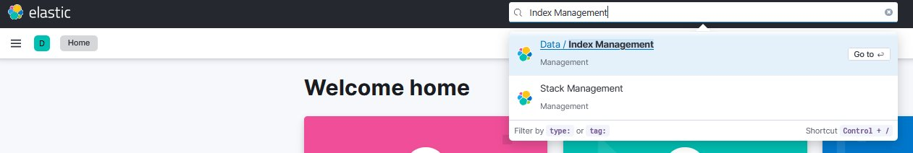{#fig-cfg-01 fig-align="center" width="90%"}

**3.** Click on the **Index Templates** tab.

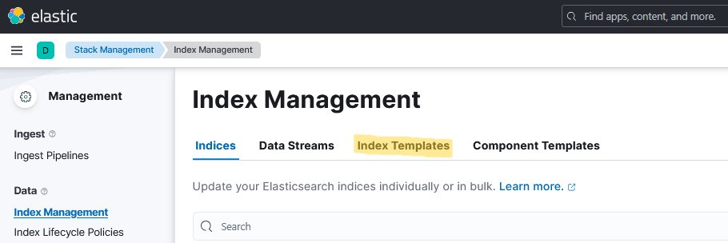{#fig-cfg-02 fig-align="center" width="80%"}

**4.** Enter **`operate-flownode`** in the search box and click the corresponding index template.

{#fig-cfg-03 fig-align="center" width="80%"}

**5.** A side window opens. Click on **Manage**, then on **Edit**.

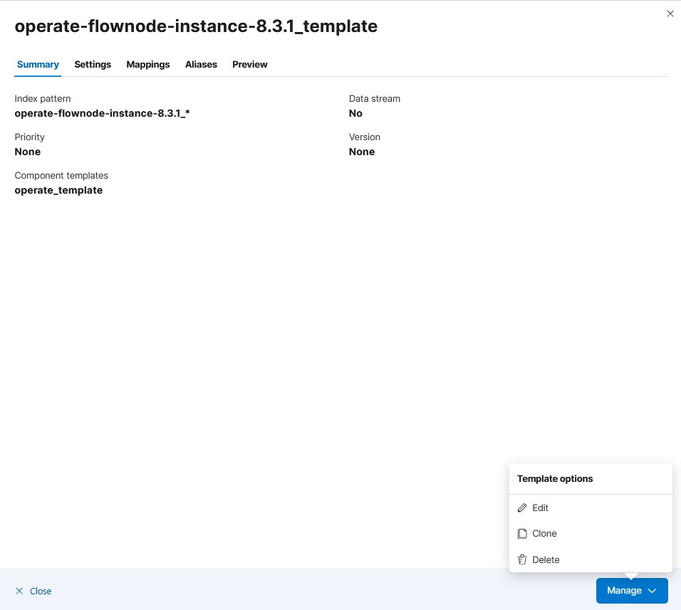{#fig-cfg-04 fig-align="center" width="55%"}

**6.** Click on **Mappings**.

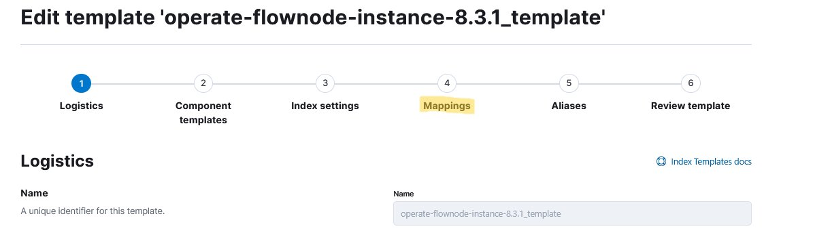{#fig-cfg-05 fig-align="center" width="80%"}

**7.** Enter **`date`** in the search box and edit the **`endDate`** field.

{#fig-cfg-06 fig-align="center" width="75%"}

**8.** A side window opens. **Disable** the *Set format* toggle and click **Update**.

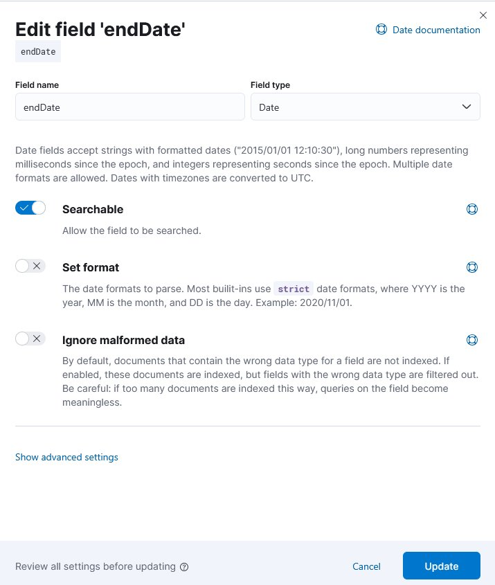{#fig-cfg-07 fig-align="center" width="45%"}

**9.** Repeat the previous step for the **`startDate`** field.

**10.** After adjusting both `endDate` and `startDate`, click **Review template**, then **Save template** to apply the changes.

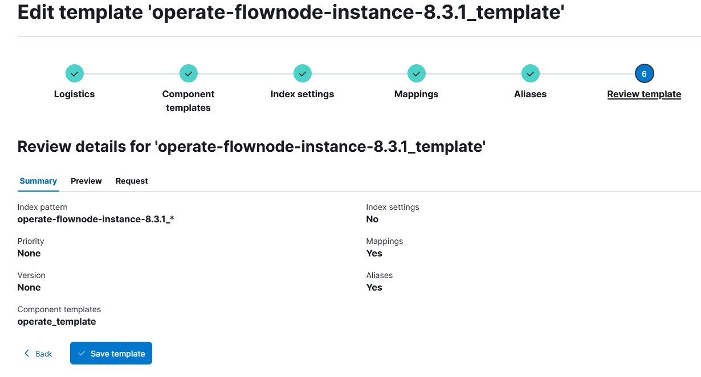{#fig-cfg-08 fig-align="center" width="75%"}

**11.** After customising the index template, the index itself must be **deleted** so that a new index is automatically created based on the updated template during operation. Click on the **Indices** tab, search for **`operate-flownode`**, and click on it.

{#fig-cfg-09 fig-align="center" width="75%"}

**12.** A side window opens. Click on **Manage**, then on **Delete index**.

{#fig-cfg-10 fig-align="center" width="55%"}

The Elasticsearch configuration is now complete. Kibana can be closed.

**13.** Restart Operate to rebuild the deleted index

Remark: If after restarting the containers, operate is not starting there might be an issue with data migration caused due to index template change. Please stop containers, remove all (or selecteed) volumens and restart container. Attention: this step will remove all data stored in the volumes, so make sure you have no important data stored so far.

### Configurations in Grafana

After configuring Elasticsearch, the remaining setup happens in Grafana so that the existing dashboards can be used.

**1.** Open Grafana at [http://localhost:3008](http://localhost:3008).

**2.** Log in with username **`admin`** and password **`admin`**.

**3.** A *Update your password* screen appears. Click **Skip** to continue without changing the password.

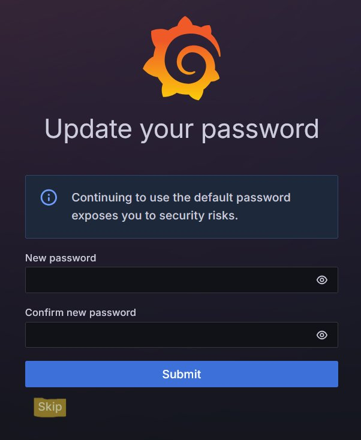{#fig-cfg-11 fig-align="center" width="40%"}

**4.** Open the side menu in the upper-left corner. Click on **Connections**, then on **Add new connection**.

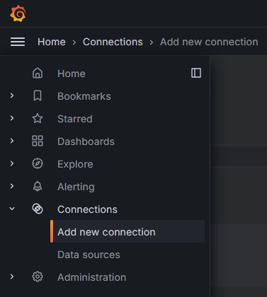{#fig-cfg-12 fig-align="center" width="35%"}

**5.** Search for **`Trino`** in the search bar and click on the result.

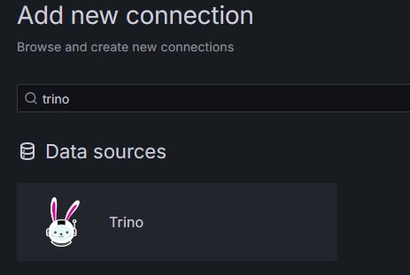{#fig-cfg-13 fig-align="center" width="45%"}

**6.** Click **Install** in the upper-right corner.

**7.** After installation, open the side menu again and navigate to **Connections → Data sources**.

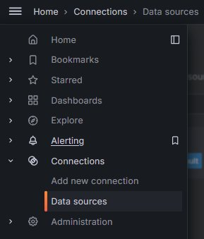{#fig-cfg-14 fig-align="center" width="30%"}

**8.** Click **Add new data source** in the upper-right corner.

**9.** Search for **`Trino`** and click on it.

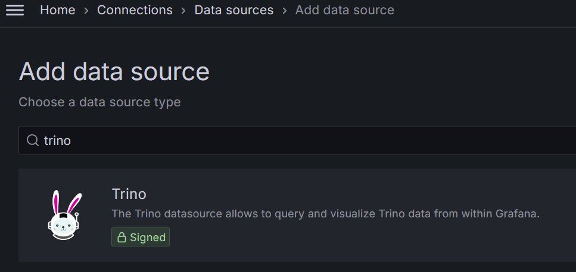{#fig-cfg-15 fig-align="center" width="70%"}

**10.** Configure the Trino data source: set **URL** to `http://trino:8080` and click **Save & test**. The connection should be established successfully.

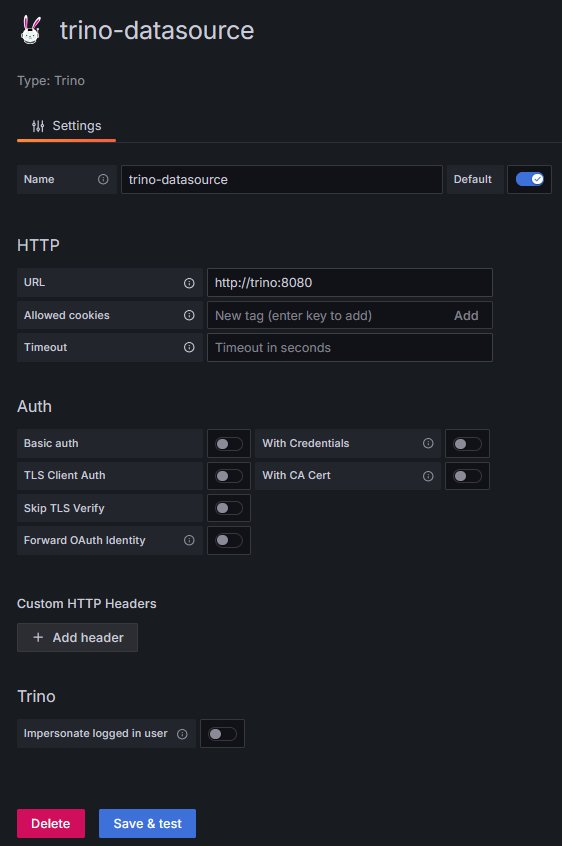{#fig-cfg-16 fig-align="center" width="40%"}

**11.** Open the side menu and click **Dashboards**.

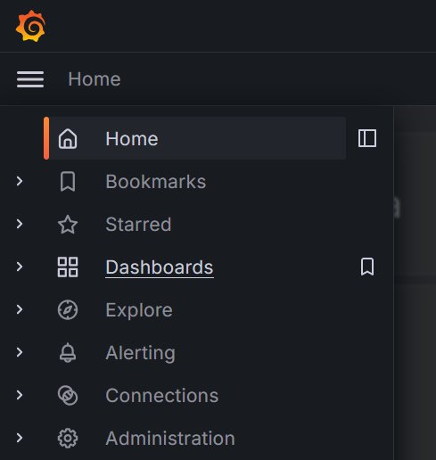{#fig-cfg-17 fig-align="center" width="35%"}

**12.** Click **New → Import**.

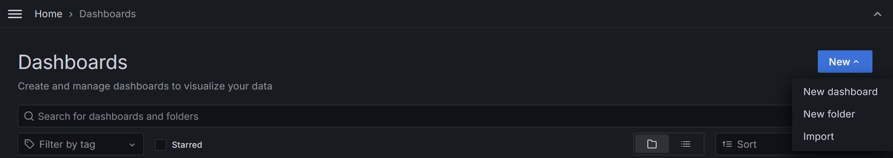{#fig-cfg-18 fig-align="center" width="90%"}

**13.** Import one of the dashboards located in the **`grafana_dashboards`** folder of your locally cloned `bpa_lab_demonstration_factory` project. The dashboards must be imported **individually**.

**14.** When opening a freshly imported dashboard, no data appears at first and each panel shows an error icon. To resolve this, enter **edit mode**, hover over a panel, click the **menu (three dots)**, and select **Edit**.

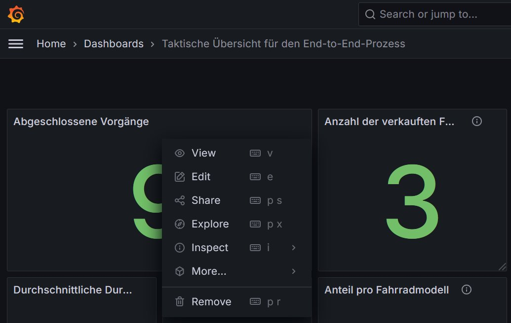{#fig-cfg-19 fig-align="center" width="70%"}

**15.** Click **Refresh** — the error icon disappears. Each panel of each dashboard must be refreshed once in this manner.

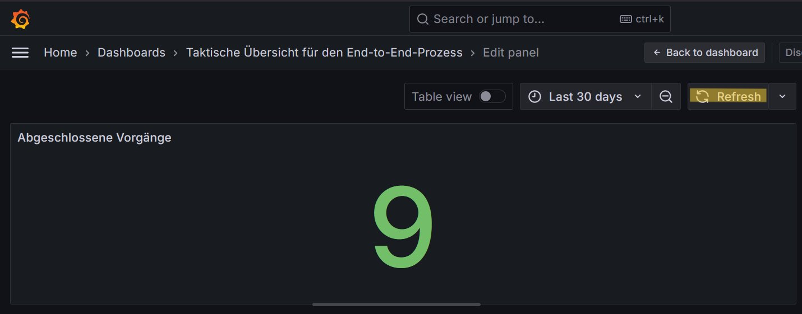{#fig-cfg-20 fig-align="center" width="80%"}

The data architecture and dashboards should now be fully configured and ready to use.

## Using the data architecture for process analysis and monitoring

### Data architecture

The data architecture combines three source systems — process applications (MySQL), the BPMS (Elasticsearch), and the FT factory (MQTT broker) — into a unified, queryable layer based on data virtualisation with Trino. Grafana sits on top and provides the dashboards.

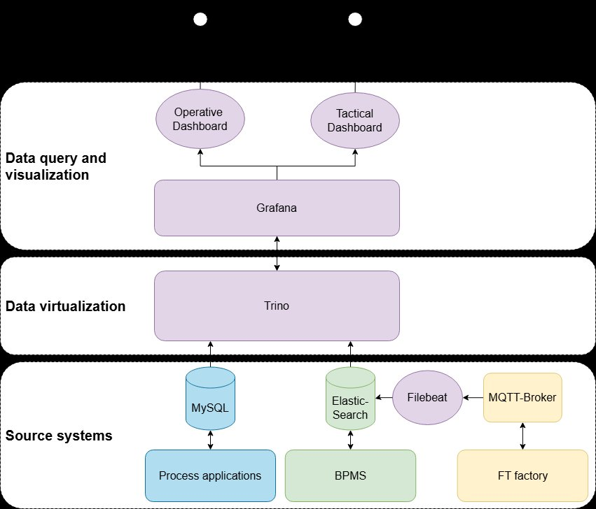{#fig-data-arch fig-align="center" width="70%"}

### Overview of the available data

The factory publishes a variety of MQTT messages on different topics. A subset of these topics is currently subscribed to by **Filebeat** (see `filebeat/filebeat.yml`) and stored in Elasticsearch:

- `bpalab/ftfactory/i/bme680`
- `bpalab/ftfactory/i/ldr`
- `bpalab/ftfactory/f/i/order`
- `bpalab/ftfactory/f/i/state/hbw`
- `bpalab/ftfactory/f/i/state/vgr`
- `bpalab/ftfactory/f/i/state/mpo`
- `bpalab/ftfactory/f/i/state/sld`

Example logs of the *manufacturing* and *stock in* scenarios are available in the [sample data folder](https://github.com/BpaLabTHCologne/bpa_lab_docs/tree/main/Sample_data) of the `bpa_lab_docs` repository.

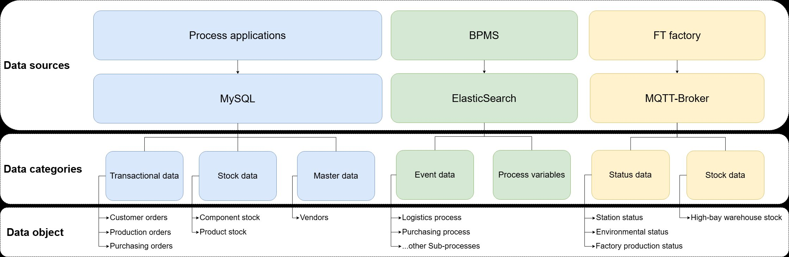{#fig-data-overview-tech fig-align="center" width="90%"}

### How to use Grafana

::: {.callout-warning}
The instructions below assume that the *first-time configuration of the data architecture* (see previous section) has already been carried out. If not, perform that configuration first.
:::

**1.** Once the Docker containers are running and have booted, open Grafana at [http://localhost:3008](http://localhost:3008).

**2.** Log in with username **`admin`** and password **`admin`**.

**3.** A *Update your password* screen appears. Click **Skip**.

{#fig-use-skip fig-align="center" width="40%"}

**4.** Open the **Dashboards** area via the side menu. The dashboards should already be listed there. Click on any dashboard to open it.

{#fig-use-dashboards fig-align="center" width="35%"}
