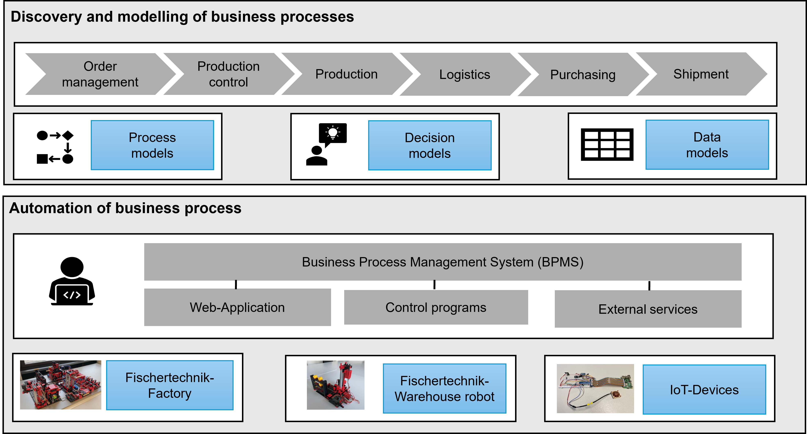

## The Business Process Automation Lab

The **Business Process Automation Lab (BPA Lab)** is an ongoing project at **TH Köln (University of Applied Sciences)** that supports research and teaching in the field of business process automation and analytics. It is run at the Faculty of Computer Science and Engineering Science and serves as a platform on which researchers and students can study and extend concepts and technologies of business process automation and analytics.

### BPA Lab as a research and demonstration platform
As a *research platform*, the BPA Lab provides an environment in which bachelor's and master's theses as well as research projects can address questions around process automation and process analysis — for example regarding automation technologies, data architectures or process mining. The projects collected in the [Projects chapter](chapter05-projects.qmd) illustrate the range of work that has been carried out on this basis.

In its demonstration role, the lab shows how:

- a fictional business scenario can be represented in **process and decision models**,
- a **Business Process Management System** orchestrates human task and service in an end-to-end business processes,
- modular **job workers** (services) implement the actual work including the integration with IOT devices,
- **Internet of Things (IoT)** devices and data can be integrated into process execution,
- **process mining** can be used to analyse process executions and identify improvement opportunities.

Especially, by bringing together software and hardware in one running system, abstract concepts become more tangible.

### BPA Lab as a teaching platform

As a *teaching platform*, the BPA Lab is used to support teaching in the field of business process management, especially business process automation and analytics. 

Business process management theory, modelling notations like BPMN and DMN and business process automation technologies are often taught using abstract examples — pizza ordering, expense approvals, generic procurement workflows. These examples are accessible but rarely convey:

- the **domain complexity** of real-world processes,
- the **technical complexity** of integrating heterogeneous systems,
- the **data perspective** that is at the heart of process mining and analytics.

The BPA Lab as the learning factory aims to bridge this gap. The customer order triggers a workflow in Camunda 8, dispatches commands via MQTT to physical hardware, and eventually leads to a manufactured product while recording data. This end-to-end visibility of the process execution makes it easier for students to grasp the concepts and technologies of business process automation and analytics. 

It offers lecturers a environment in which existing processes can be demonstrated, new processes be designed, implemented in a BPMS, executed against physical hardware, and analysed using the resulting data. 

The didactic rationale and an early evaluation of this approach are documented in the project's first SoTL publication ([Projects chapter](chapter05-projects.qmd#sec-sotl-cos1326)).

## Components of the BPA Lab

The BPA Lab is built around a **fictional business scenario** (see [Business Scenario](chapter01-business-scenario.qmd)), which is represented by a set of process, decision, and data models. This scenario is implemented through **business process automation systems** (see [Solution Overview](chapter02-solution-overview.qmd)). As part of the implementation, hardware components are also controlled.

{#fig-concept fig-align="center"}

Building on these components, several projects have been carried out and are documented in the [Projects](chapter05-projects.qmd) chapter.

## Structure of this document

This book s structured as follows:

1. **Business scenario:** The end-to-end bicycle ordering, manufacturing, and shipment process, broken down into its sub-processes (order management, production control, purchasing, manufacturing, shipment, warehouse operations).
2. **Solution overview:** Why a demonstration factory, and the three architectural layers — controllers, process applications, workflow engine.
3. **Software architecture:** Requirements, a C4 view of the system, and the architecture decisions taken so far.
4. **Data and data sources:** Data model, data flows, and persistence in the BPA Lab.
5. **Projects:** Research and teaching projects conducted using the BPA Lab.
6. **Technical instructions:** Operational instructions for running the demonstration factory, executing end-to-end processes, and configuring and using the data architecture.

The appendices contain:

- **Appendix A:** Overview of related components and related repositories.
- **Appendix B:** A glossary of key terms.
- **References:** All cited literature.

## Who this document is for

This is a project documentation written for:

- Primary, the book is generated for **students** working on bachelor's or master's projects or any other project inside the BPA Lab.
- Other **lecturers and researchers** who are interested in teaching business process automation with a tangible, end-to-end reference system.
- **Practitioners** looking for concepts on combining BPMS, IoT hardware, and process mining.

## Source code and related repositories

The implementation of the demonstration factory is maintained as a separate repository: [bpa_lab_demonstration_factory](https://github.com/BpaLabTHCologne/bpa_lab_demonstration_factory).

Documentation for student component projects is available in the wiki of [bpa_lab_student_docs](https://github.com/BpaLabTHCologne/bpa_lab_student_docs/wiki).

## Status and roadmap

::: {.callout-important}
## Work in progress
The BPA Lab — and this book — are under continuous development. Several sections are marked as *work in progress* and will be expanded in future revisions. Bug reports and suggestions are very welcome via the [issue tracker](https://github.com/BpaLabTHCologne/bpa_lab_book/issues).
:::

## Licence and citation

This work is published under the **Creative Commons Attribution-ShareAlike 4.0** licence (CC BY-SA 4.0).

Suggested citation:

> Zapp, Matthias (2026). *The BPA Lab — Architecture and Documentation of a Demonstration Factory for Business Process Automation and Analytics.* TH Köln (University of Applied Sciences). Online: <https://bpalabthcologne.github.io/bpa_lab_book/>.
